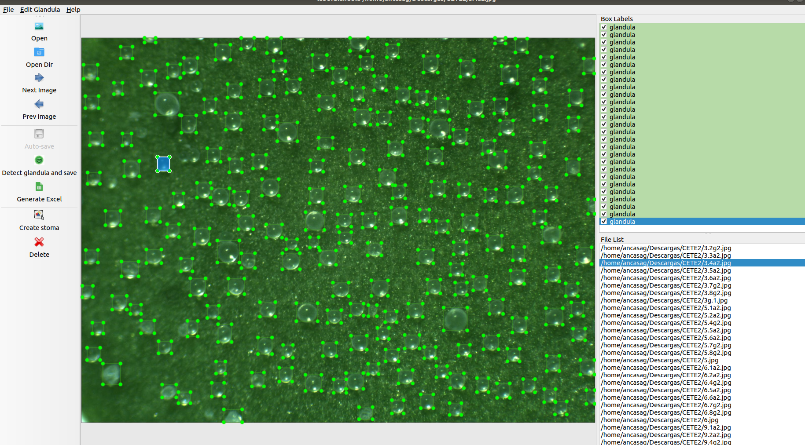

# LabelGlandula
labelGlandula is a graphical image tool for automatically detecting stomata in images. In addition, labelGlandula also provides the necessary tools to correct the detections. labelGlandula is based on the [LabelImg tool](https://github.com/tzutalin/labelImg).


## Installation and Requirements

LabelGlandula can be run on Linux, Windows and macOS. 

### Get from PyPI but only python3.0 or above

LabelGlandula can be installed both in Linux and Windows using pip.

``` 
pip install labelStoma
labelStoma
``` 

### Build from source

#### Using Linux
This tool requires Python 3.6 and Qt5 and the packages listed in the ```requirements.txt``` file.

1. Clone this repository.

```bash
git clone https://github.com/ancasag/labelGlandula
```

2. Install the necessary dependencies.

```bash
cd labelGlandula
sudo apt-get install pyqt5-dev-tools
pip3 install -r requirements.txt
make qt5py3
```

3. Run labelStoma:
```bash
python3 labelGlandula.py
```
#### Using macOS

This tool requires Python 3.6 and Qt5 and the packages listed in the ```requirements.txt``` file.

1. Clone this repository.

```bash
git clone https://github.com/ancasag/labelGlandula
```
2. Install the necessary dependencies.
```bash
brew install qt  # Install qt-5.x.x by Homebrew
brew install libxml2

or using pip

pip3 install pyqt5 lxml # Install qt and lxml by pip
make qt5py3
```
3. Run labelGlandula:
```bash
python3 labelGlandula.py
```
## Hotkeys
|          |                                |
|----------|--------------------------------|
| Ctrl + o | Open a image                   |
| Ctrl + u | Open a set of images           |
| Ctrl + q | Close the app                  |
| Ctrl + w | Close the image                |
| z        | Detect cell                    |
| e        | Generate excel                 |
| r        | Create a new cell detection    |
| del      | Delete the selected rect box   |


## Acknowledgments
This work was partially supported by Ministerio de Economía y Competitividad [MTM2017-88804-P], Ministerio de Ciencia, Innovación y Universidades [RTC-2017-6640-7], and Agencia de Desarrollo Económico de La Rioja [2017-I-IDD-00018].


